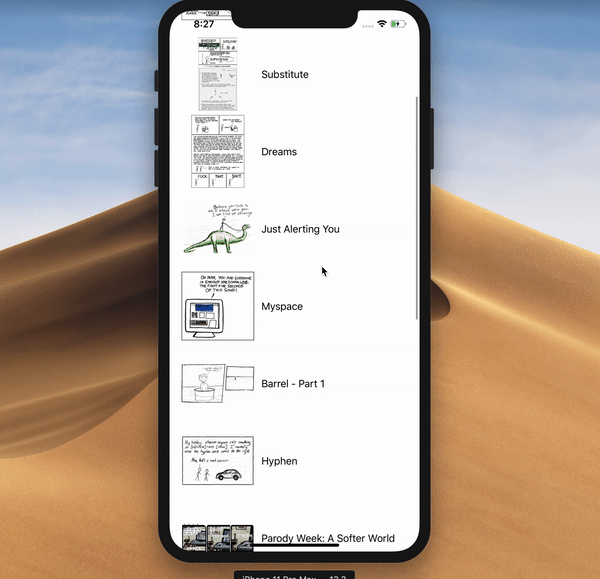

# UICollectionView sample

This repository contains a sample app using UICollectionView.

-   Fetches 15 random comics from [xkcd's API](https://xkcd.com/json.html) and displays them in a collection view.
-   Shows one comic per row when in portrait and 3 when in landscape

## Dependencies

This project uses Swift Package Manager to manage dependencies.

-   [Alamofire](https://github.com/Alamofire/Alamofire) to fetch comics from xkcd's API
-   [AlamofireImage](https://github.com/Alamofire/AlamofireImage) to fetch comics' images
-   [Promises](https://github.com/google/promises) to handle asynchronous code

If the dependencies have not been resolved you can:

-   Run `xcodebuild -resolvePackageDependencies` in the terminal
-   Or in Xcode go to `File -> Swift Packages -> Resolve Package Versions`

## How to run

Open `CollectionViewSample.xcodeproj` and run the app.

If you get any errors about dependencies, make sure you have resolved them first (see [Dependencies section](##Dependencies))
