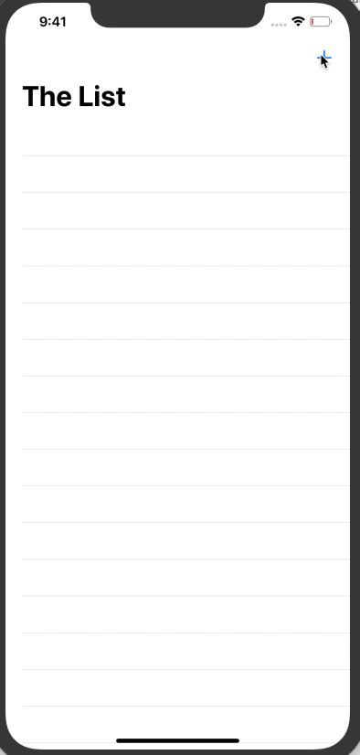

# Core Data sample

This repository contains a sample app using Core Data. It allows the user to add names and displays them in a list. Names are stored using Core Data.

This sample was developed based on the [tutorial from Raywenderlich](https://www.raywenderlich.com/7569-getting-started-with-core-data-tutorial)

## How to run

Open `HitList.xcodeproj` and run the app.

Click the Run button to start the animation.
