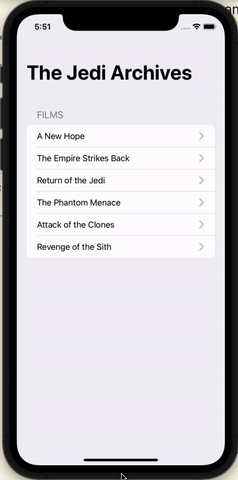

# GraphQL sample

This repository contains a sample app using GraphQL. It displays a list of Starwars movies, each movie's info and the characters.

This sample was developed based on the [tutorial from Raywenderlich](https://www.raywenderlich.com/10886648-graphql-using-the-apollo-framework-getting-started)



## How to run
1. Go to the folder `SWAPI GraphQL` and start the server:
```bash
yarn        # to build the server
yarn start  # to start the server
```
Your terminal will display a port number, make a note for it (you will need it next)

2. Go to folder `Jedi Archives` and open `JediArchives.xcodeproj`, replace the url port number in `Apollo.swift` file, then run the app.
