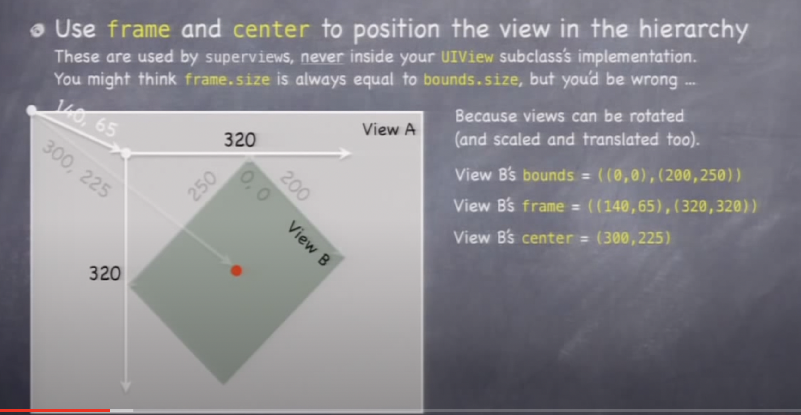

https://itunes.apple.com/us/course/developing-ios-7-apps-for-iphone-and-ipad/id733644550

https://web.stanford.edu/class/cs193p/cgi-bin/drupal/downloads-2013-fall

# Creating objects

We use alloc and init, but we also use class methods. Sometimes both a class creator method and init method exist

Class methods were used before ARC to be clear how to reference and de-reference objects. Class methods would create the object so it could be released in a certain way

Looks like Apple is moving towards alloc/init

Other ways of creating objects:

* Other objects create new objects 
  * NSString `stringByAppendingString`
  * NSArray `componentsJoinedByString`
  * NSString & NSArray `mutableCopy`

Unless a method has the word `copy` in it, we get a pointer. For example: NSArray `lastObject`

# nil

Sending messages to `nil` does not make the app crash, code is not executed thats all

`int i = [obj methodWhichReturnsNil]` will return *zero* if obj is nil

Careful if the method returns a C struct, we do need to check if its nil: 

`CGPoint p = [obj getLocation]` will return *undefined* if obj is nil

# Dynamic Binding

Objective-C has an important type called `id` => *pointer* to an object of unknow/unspecified type

`id myObject`

All pointers in Objective-C are `id`s

If we use `id` instead of a specific type (i.e `NSString`) the code to execute when a message is sent is figured out at runtime. This is called dynamic binding

Is this safe? 
* If we send a message to an object and it doesn't understand it? Crash

However, we should use specific types, hence use `static binding`

```objc
NSString *s = @"x"; // statically typed

id obj = s; // not statically typed, but compiler can't catch `[obj rank]`

NSArray *a = obj; // Legal, but will lead to trouble
```

⚠️ never use `id *`, `id` is a pointer, that would mean a pointer to a pointer to an object -> ❌

```objc
NSString *hello = @"hello";
NSArray *test = (NSArray *)hello; // no error
[test firstObject]; // crash
```

To make dynamic typing safer, we should use Introspection and Protocols

`Introspection`: asking at runtime what class an object is or what messages can be sent to it

`Protocols`: a syntax that is 'in between' `id` and `static typing`. Does not specify the class of an object pointed to, but does specify what methods it implements


## Introspection (@ runtime)
We use it for example for:
* Getting objects out of array (since arrays don't specify the type)
* MVC communication (target, action, delegation, etc)

`isKindOfClass` // inheritance included

`isMemberOfClass`// no inheritance

`respondsToSelector` // checks if object has a method with that signature


`SEL` is the objective-c type for a selector:
```objc
SEL shootSelector = @selector(shoot);
```

If we have a `SEL` we can ask an object to perform it:

```objc
// Single object
[objc performSelector: shootSelector];
[objc performSelector: shootSelectorArgs withObject:param];

// Ask array perform selector for all elements
[array makeObjectsPerformSelector: shootSelector];

// UIButton
[button addTarget: self action:@selector(pressed:) ...];
```

# Foundation Framework

## NSObject
Base class for pretty much every object in the iOS SDK

Implements instrospection

Implements `description`

```objc
NSLog(@"array contents are %@", myArray);
// The `%@` is replaced with the results of invoking `[myArray] description`
```

### Copying objects:
Methods `copy` (immutable copy) and `mutableCopy` vary from class to class, because they are up to the class to implement.

Not all objects implement these methods

NSObject **does not** implement these methods

## NSArray
Ordered collection of objects

Immutable

All objects in the array are held onto strongly in the heap. As long as the array is in the heap (someone has a strong pointer to the array itself) all the objects that are in the array will stay in the heap as well, because there will be strong pointers to all of them

### NSMutableArray
Mutable version of `NSArray`

Inherits all of `NSArray`'s methods

Create with:
* `alloc`/`init`
* `+ (id)arrayWithCapacity:(NSUInteger)numItems;` numItems is a *performance hint* only, the array is not initialized with that amount of items
* `+ (id)array` => `[NSMutableArray array]` == `[[NSMutableArray alloc] init]`

## Eumeration
Looping through members of an array in an efficiente manner `for-in`

```objc
NSArray *myArray = ...;
// this is casting:
for (NSString *string in myArray) { // no way for compiler to know what `myArray` contains
  double value = [string doubleValue]; // ⚠️ crash if `string` is not `NSString`
}

// alt
for (id obj in myArray) {
  if ([obj isKindOfClass...])
}

```

## NSNumber
Object wrapper around primitive types like `int`, `float`, `double`, `BOOL`, `enum`s, etc

```objc
NSNumber *n = [NSNumber numberWithInt: 36];
float f = [n floatValue];
NSNumber *three = @3;
```

## NSValue
Generic object wrapper for some non-object, non-primitive data types (i.e C structs)

```objc
NSValue *edgeInsetsObject = [NSValue valueWithUIEdgeInsets:UIEdgeInsetsMake(1, 1, 1, 1)];
```
A good way to wrap up a struct is to turn it into a string

## NSData
"Bag of bits". Used to save/restore/transmit raw data throughout the iOS SDK
## NSDate
Used to find out the time right now or to store past or future dates/time
Careful with localization of dates

## NSSet / NSMutableSet
Like an array, but no ordering (no `objectAtIndex:` method)

## NSOrderedSet / NSMutableOrderedSet
A cross between `NSArray` and `NSSet`

## NSDictionary
Immutable collection of objects looked up by a key (has table)
All keys and values are hel onto `strong`ly by an NSDictionary

```objc
NSDictionary *colors = @{@"green": [UIColor greenColor], @"blue": [UIColor blueColor]};

// To lookup
// `key` *must* implement `hash` and `isEqual:` properly
UIColor *colorObject = colors[@"xyz"];
UIColor *colorObject = [colors objectForKey:@"xyz"];
```

⚠️ Careful with `NSObject`'s `hash` and `isEqual:`
* `hash` is the pointer
* `isEqual:` is `==`

If you use a NSObject as a key, it will probably do pointer hashing and it will fail: no two objects will be the same because no two objects have the same pointer

`NSString` are excellent keys

## NSMutableDictionary
Mutable version of `NSDictionary`

Create using `alloc`/`init` or one of the `+ (id) dictionary...` class methods

Looping through the keys or values:
```objc
NSDictionary *myDic = ...;
for (id key in myDic) {
  id value = [myDict objectForKey: key];
}
```

## Property list
Collection of collections

Any graph of objects containing `NSArray, NSDictionary, NSNumber, NSString, NSDate, NSData` (or mutable subclasses).

An `NSArray` is a Property List if all its members are too

An `NSDictionary` is one only if all keys and values are too

## NSUserDefaults
Lightweight storage of Property Lists

Not a full-on database, so only store small things like user preferences

Always remember to call `synchronize` to make the changes permanent

## NSRange
C struct (not a class)

⚠️ We **don't** put structs in the heap

A possible location can be `NSNotFound`: value of `location` in a range that was not found
```objc
NSString *greeting = @"hello word";
NSString *hi = @"hi";
NSRange r = [greeting rangeOfString:hi];
if (r.location == NSNotFound) { /* couldn't find `hi` inside `greeting`*/}
```

`NSRangePointer`: `NSRange *...`

^ is for call by reference range (so it can be modified)

# UIKit

## UIView
Represents a rectangular area, defines a coordinate space

Draws and handles events in that rectangl

Hierarchical:
- Only has one superview
- Can have zero or more subcviews
  - Subview order matters. Those latter in the array are on top of those earlier
- Can clip its subviews to its bounds or not (if so, it prevents the subviews from being drawn outside of the view)

```objc
- (void)addSubview:(UIView *)aView; 
- (void)removeFromSuperview;
```

Each view controller has a property called `view` -> it is the top level view that contains all the views in the view hierarchy for the MVC

If we want to override the UIView's designated initializer, we should do it in `awakeFromNib` because `initWithFrame:` is **NOT** called for a UIView coming out of a storyboard, `awakeFromNib` is.

Typical code:
```objc
- (void)setup { ... }
- (void)awakeFromNib { [self setup]; }
- (id)initWithFrame: (CGRect)rect {
  self = [super initWithFrame:rect];
  [self setup];
  return self;
}
```

### UIWindow
View at the top of the view hierarchy

Only one UIWindow in an iOS app

### View coordinates

- CGFloat: floating point number used for graphics
- CGPoint: C struct with 2 CGFloats in it (x and y)
- CGSize: C struct with 2 CGFloats in it (width and height)

Origin of a view's coordinate system is upper left!

```
(0,0) -> 
  |
  v
```

Units are "points"

How many pixels per point? `contentScaleFactor` property from view

Properties related to location and size:
- `CGRect bounds;` View's internal drawing space's origin and size. Used inside the view's own implementation
- `CGPoint center;` Center of your view in your `superview`'s coordinate space
- `CGRect frame;` Rectangle in your `superview`'s coordinate space which contains the view's `bounds.size`

My view's `bounds.size` is **not** always equal to `frame.size` because the view can be rotated. If its in a diamond shape, the frame might be bigger



### How to create a view?
Use `alloc` and `initWithFrame:` or use `init` (frame will be CGRectZero)

### How to draw?
Create a UIView subclass and override method `- (void)drawRect:(CGRect)rect;`. We can use Core Graphics framework directly (C API) or use UIBezierPath class

**NEVER** call `drawRect`. But you can let iOS know that the view's visual is out of date with:
- `- (void)setNeedsDisplay;`
- `- (void)setNeedsDisplayInRect:(CGRect)rect;`

These ^ will end up calling `drawRect:` at an appropriate time


## Core graphics
Core graphics workis in a 4-step process:
1. Get a context to draw into
1. Create paths (triangles, squares, rounded rects, etc)
1. Set colors, fonts, textures, linewidths, linecaps, etc
1. Stroke or fill the paths

### Context
Context determines where the drawing goes (screen, offscreen bitmap, pdf, printer)

For normal drawing, UIKit sets up the current context (but only valid during the call to `drawRect`). A new context is set up each time `drawRect` is called so don't cache it

UIBezierPath draws into the current context. For Core Graphis C functions, call `CGContextRef context = UIGraphicsGetCurrentContext();`

### Create Path
Let's create a triangle

```objc
UIBezierPath *path = [[UIBezierPath alloc] init];
[path moveToPoint: CGPointMake(75,10)];
[path addLineToPoint: CGPointMake(160, 150)];
[path addLineToPoint: CGPointMake(10, 150)];
[path closePath]; // connects last point back to the first

// At this point nothing has been drawn yet, so we need to fill
// and stroke the path as follows:

[[UIColor greenColor] setFill];
[[UIColor redColor] setStroke];
[path fill];
[path stroke];
```

To "clip" my drawing to be inside a rect (i.e roundedRect) we have to call: `[roundedRect addClip];`

To set a view to be transparent we have to:
a) either set the `opaque` property to `NO` & `backgroundColor` to `nil`
b) OR set the `alpha` property

⚠️ Transparency is not cheap (performance-wise)

### Graphics State
If we want to have a utility method that draws something, we need to make sure we save and restore the state:

```objc
- (void)drawGreenCircle:(CGContextRef)ctxt {
  CGContextSaveGState(ctxt);
  [[UIColor greenColor] setFill];
  // draw circle
  CGContextRestoreGState(ctxt);
}

- (void)drawRect:(CGRect)rect {
  CGContextRef context = UIGraphicsGetCurrentContext();
  [[UIColor redColor] setFill];
  // do stuff
  [self drawGreenCircle:context];
  // do more stuff and expect fill color to be red
}
```

### Drawing text
a) We can use a `UILabel` as a subview to draw text in our view

b) But we can draw in `drawRect:`
    
    ```objc
    NSAttributedString *text = ...;
    [text drawAtPoint:(CGPoint)p]; // drawAtPoint is added by UIKit via a Category
    ```

### Drawing images
a) We can use a `UIImageView`

b) But we can also draw with CGContext

    ```objc
    UIGraphicsBeginImageContext(CGSize);
    // draw with CGContext funcionts
    UIImage *myImage = UIGraphicsGetImageFromCurrentContext();
    // several options to draw
    [myImage drawAtPoint:(CGPoint)p]; // p is the upper left corner of the image
    [myImage drawInRect:(CGRect)r]; // scales the image to fit in r
    [myImage drawAsPatternInRect:(CGRect)patRect]; // tiles the image into patRect
    
    UIGraphicsEndImageContext();
    ```

### What if my bounds change?
There is no redraw, but the bits will get stretched. But if that's not what we want then there is a property called `contentMode` and tells what happens when the bounds change

```objc
UIViewContentMode{Left,Right,Top,Right,BottomLeft,BottomRight,TopLeft,TopRight} // moves the bits of your drawing to that location
UIViewContentModeScale{ToFill,AspectFill,AspectFit} // stretches the bits of your drawing
UIViewContentModeRedraw // calls `drawRect:` to redraw everything when the bounds change

// Default is UIViewContentModeScaleToFill
```

## UIGestureRecognizer
Get notified of raw touch events (touch down, moved, up).

We need to
1. Add gesture recognizer to a view
1. Provide a method to call (handler) when the gesture happens

```objc
UIPanGestureRecognizer *pangr = [[UIPanGestureRecognizer alloc] initWithTarget:view action:@selector(pan:)];
[view addGestureRecognizer:pangr];
```

Each concrete class of a gesture recognizer provides methods to implement the target of that gesture

UIGestureRecognizer has a `state` and has the following possible values depending on the gesture:
- possible
- recognized (for discrete gestures)
- began (for continuous gestures)
- changed
- ended
- cancelled

## UIColor
An object representing a color

Alpha: (how opaque a color is)
* 1: fully opaque
* 0: fully transparent

## UIFont
We need to get fonts right

```objc
UIFont *font = [UIFont preferredFontForTextStyle: UIFontTextStyleBody];

/** Other styles:
UIFontTextStyleHeadline
UIFontTextStyleCaption1
UIFontTextStyleFootnote
...
*/
```

There are also `system` fonts that are used in places like button titles. However, you should **never** use it for your user's content, we should use `preferredFontForTextStyle`

## UIFontDescriptor
A `UIFontDescriptor` attempts to categorize a font anyway. It does so by family, face, size, and other attributes. You can then ask for fonts that have those attributes and get a "best match"

## Attributed String - NSAttributedString
How text looks on screen

Is 'like' an NSString where each character has an NSDictionary of "attributes". The attributes are things like the font, the color, underlining, etc of the character

Its **not** a subclass of `NSString`, but it **does** provide a method `string`

```objc
- NSString *string;
```

The method `string` is guaranteed to be very high performance but its volatile. If you want to keep it aroundm, make a `copy` of it.

## NSMutableAttributedString
Mutable version of `NSAttributedString`

If we want to modify the characters in an NSMutableAttributedString
```objc
- NSMutableString *mutableString;
```

If we modify the `mutableString` ^, the `NSMutableAttributedString` (its attributes) will track the changes

### What kind of attributes are there
* NSFontAttributeName
* NSForegroundColorAttributeName
* NSStrokeWidthAttributeName: negative number means "fill and stroke", positive numbers is "stroke" only (outline)
* NSStrokeColorAttributeName
* NSUnderlineStyleAttributeName
* NSBackgroundColorAttributeName

### Where do attributed strings get used?
* UIButton `-(void)setAttributedTitle(NSAttributedString *)tile forState:...;`
* UILabel `NSAttributedString *attributedText;`
* UITextView `NSTextStorage *textStorage;`

### Drawing string directly
We can also draw string directly. `NSAttributedString`s know how to draw themselves on screen

```objc
- (void)drawInRect: (CGRect)aRect;
```

## UILabel
`attributedText` is immutable

So to modify a `UILabel`, you need to make a `mutableCopy`, modify it and set it back
```objc
NSMutableAttributedString *labelText = [myLabel.attributedText mutableCopy];
[labelText setAttributes:...];
myLabel.attributedText = labelText;
```

## UITextView

Scrollable, editable/selectable view of a mutable attributed string

Similar to UILable, but multi-line.

We can set a NSMutableAttributedString & NSFont

## View Controller lifecycle
Sequence of messages (series of methods) sent to UIViewController when things happen

Why does this matter?
* to override them when needed

### How is it?
**Start of the lifecycle**
- Creation: most VC's are created out of the storyboard

**What then?**
- outlet setting
- appearing and disappearing
- geometry changes (device rotation for example)
- low-memory situations

at each stage, iOS invokes method(s) on the Controller

⚠️ always let `super` have a chance in lifecycle methods

### viewDidLoad
- Outlets have been set
- A good  place to put a lot of setup code
- Only called once
- Bounds (geometry) of the view **not** finalized at this point, so ⚠️ dont ⚠️ initialize things that are geometry-dependent here

### viewWillAppear
- Call just before the view appears on screen
- Can be called multiple times
- View will only get "loaded" once, but it might appear and disappear a lot
- Do something here if things you display are changing while your MVC is off-screen
- We can do stuff here to optimize performance (i.e doing a network call in viewDidLoad might not be needed if the view never appears and we wasted resources on it)
- The view's geometry is set here so we *could* set some initialization based on geometry here, but there is a better place to do geometry-based initialization. However, geometry *can* change after viewWillAppear (for example when view rotates we wont get viewWillAppear called)

### viewWillDisappear
- Where we put "remember what's going on" and cleanup code
- Stop using resources
- Don't do anything time-consuming here or app will be sluggish, maybe kick off a thread to do what needs doing here

### view{Will,Did}LayoutSubviews
- Called any time a view's frame changed and its subviews were thus re-layed out (i.e. autorotation)
- We can rese the frames of the subviews here or st other geomety-affecting properties
- Between "will" and "did", autolayout will happen

### Autorotation
- Happens only if:
  - `shouldAutorotate` returns `YES`
  - `supportedInterfaceOrientations` returns the new orientation
  - The application allows rotation to that orientation (defined in Info.plist file)

### didReceiveMemoryWarning
- In low-memory situations this method is called.
- Rarely happens
- Images, video and/or sounds use a lot of memory. Small dictionaries dont use a lot of memory
- If it is called, we might need to release anything "big" that can be recreated (i.e an alternate image or something thats not on screen)

### awakeFromNib
- Happens before outlets are set
- Put things here that can't wait until `viewDidLoad`
- This method is sent to all objects that come out of a storyboard
- UIViewController's designated initializer is `initWithNibName:bundle:`

### Summary
1. Instantiated (from storyboard)
1. awakeFromNib
1. outlets get set
1. viewDidLoad
1. [when geometry is determined] viewWillLayoutSubviews & viewDidLayoutSubviews
1. [can happen repeatedly as the VC appears and disappears from the screen] 
    1. viewWillAppear and viewDidAppear
    1. [when geometry changes again while visible i.e rotation] viewWillLayoutSubviews & viewDidLayoutSubviews
    1. viewWillDisappear and viewDidDisappear
1. [if memory gets low] didReceiveMemoryWarning

## NSNotification
The "radio station"

### NSNotificationCenter
Default notification center. 

Access it via `[NSNotificationCenter defaultCenter]`

If we want to "listen to a radio station" call `addObserver:selector:name:object:`
- observer: the object to get notified
- selector: method to invoke if something happens
- name: name of the sation (a constant)
- object: whose changes you are interested in (nil is anyone's)

The method that is called when there are broadcasts `selector`
- selector:notification

The `notification` has the following properties:
- name: name passed above
- object: object sending the notification
- userInfo: notification-specific info about what happened

When we are done listening, we need to "tune out". Failure to remove yourself can sometimes result in crashes because the `NSNotificationCenter` keeps an 'unsafe retained' pointer to you (not strong nor weak). Its 'unsafe retained' due to backwards compatibility, it should be weak.
'unsafe retained' means is the if you go out of the heap without calling the `remove` method first, the notification center might try to send a notification and crash the app.
- removeObserver: // to remove from all radio stations. If Im not an observer, this method call wont fail
- removeObserver:name:object // to remove from a specific station

We also need to remove ourselves when the view goes off screen. Or we can also remove ourselves in a method called `dealloc` (called when you leave the heap)

```objc
- (void)dealloc {
  // be careful in this method. can't access properties. you are almost gone from heap
  // gets called just before the object leaves from the heap. All properties are nil

  // just to fix unsafe retained pointer
  [[NSNotificationCenter defaultCenter] removeObserver:self];
}
```

# Scene
We call a particular layout of a View for a Controller in Xcode a "scene"

# Segue 
When the segue is being prepared `prepareForSegue:sender:`, the outlets are not set on the destination view controller. It happens between `awakeFromNib` and `viewDidLoad`.

We can prevent a segue from happening: `shouldPerformSegueWithIdentifier:sender`

Navigation controller inside a tabbar controller is ok. What's not so common is a tabbar controller inside a navbar controller

Segues are always new instances, there is no reuse

# Protocols
Syntactical modification of `id`, for example `id <MyProtocol> obj`

Declare it with `@protocol`

Make optional methods/props with `@optional` and required with `@required`

Protocols can also conform to other protocols `@protocol Foo <AnotherProtocol1, AnotherProtocol2>`

A useful protocol to conform to is `NSObject` because has things like `class`, `isEqual:`, `isKindOfClass:`, `description`, `performSelector:`, etc

Where do @protocol declarations go? In header files, or in its own dedicated header file

Where do I conform to a protocol? In the `@interface` declarations => `@interface MyClass: NSObject <Foo>` (public) or `@interface MyClass() <Foo>` (private), but **not both**

This is a tool the compiler helps you, but it makes no difference at runtime

Uses:
- delegates and dataSources
- dataSources and views
- declaring what things are animatable

# Blocks
Block of code

Start with caret ^, then (optional) return type, then (optional) arguments in parenthesis, then `{  <code> }`

We can use local variables declared *outside* of the block, but they are readonly unless we use `_block`

```objc
_block BOOL stoppedEarly = NO;

// block: 
{
    stoppedEarly = YES;

    // for pointers, the block will automatically have a strong pointer to it until the block goes out of scope
}
```

Blocks sort of act like objects:
- Can be stored inside other objects (properties, arrays, dictionaries)
- Their only "method" is `copy`

## Memory cycles
Happens if a block strongly references self and self holds the block strongly.

To fix it: we can use `__weak` => `__weak MyClass *weakSelf = self;`

**Rules**:

If there are no arguments:
```objc
[UIView animateWithDuration:5.0 animations: ^() { 
  // ....
}]

==>
[UIView animateWithDuration:5.0 animations: ^{ 
  // ....
}]
```

If the return value can be inferred:
```objc
[mySet objectsPassingTest: ^BOOL(id obj, ..) { 
  return YES;
}]

==>
[mySet objectsPassingTest: ^(id obj, ..) { 
  return YES;
}]
```

# Animations
There are 3 ways to animate views:
1. Certain UIView properties can be animated over time: frame, transform (translation, rotation and scale) and alpha (opacity)
  ```objc
  // changes made in the method happens immediately
  [UIView animateWithDuration:delay:options:animations:completion:]
  ```

2. Modify an entire view at once, for example flip view (that does not involve the properties from option # 1)
  ```objc
  [UIView transitionWithView:duration:options:animations:completion:]
  ```

3. Change the view hierarchy
  ```objc
  [UIView transitionFromView:toView:duration:options:completion:]
  ```

# Dynamic animation
Set up physics relating animatable objects and let them run until they resolve to stasis

a. Create UIDynamicAnimator
b. Add UIDynamicBehaviors to it (gravity, collisions, etc)
c. Add UIDynamicItems (usually UIViews) to the UIDynamicBehaviors. Animating will start immediately

```objc
// all views need to be in a view hierarchy, *view* is the view at the top where animations will happen
UIDynamicAnimator *animator = [[UIDynamicAnimator alloc] initWithReferenceView:view];
```

# Autolayout
Setting UIView frames using rules rather than numbers

# Multithreading
Multithreading is mostly about 'queues' in iOS. 

- Main queue: all UI activity happens in this queue. Time consuiming must **no** occur here
- Other queues

# UIScrollView
Useful properties:
- contentSize: we need to set this ⚠️
- contentOffset
- bounds

## Zooming
All UIView's have a property (transform) which is an affine transform (translate, scale, rotate)

Scroll view simply modifies this transform when you zoom.

Zooming affects the scroll view's contentSize and contentOffset

Properties:
- minimumZoomScale
- maximumZoomSacle

Will not work withhout delegate method `- (UIView *)viewForZoomInScrollView:(UIScrollView *)sender;`

We can also zoom to a specific rect

# UISplitViewController
Requires delegate to be set (most likely in `awakeFromNib`, no it `viewDidLoad`), because the split view controller starts sending its delegate methods way before `viewDidLoad`.

But then, when the delegate methods get sent, my outlets arent set yet

# UIPopoverController
Its not a UIViewController. Instead it has a @property that holds the UIViewController that is inside it (`contentViewController`)

Popover is dismissed when user touches outside of it. Unless the user touches in one of the views in this array property in UIPopoverController `passthroughViews` (i.e. when using tabbar)

# CoreData
Object oriented database

NSManagedObject is the super class for all objects in the db

NSManagedContext: to access core data from the code

UIManagedDocument: inherits from UIDocument which provides a lot of mechanism for the management of storage. A container for the Core Data db. UIManagedDocuments autosave themselves, 

# UIApplication
Shared instance of UIApplication object in the application

It has a network activity indicator `networkActivityIndicatorVisible` (spinner on status bar). It can be somewhat difficult to use this property correctly because its global and its a boolean; if i have multiple thread using the netwrok I need to make sure Im setting this property properly

Background fetches: check if we need to set out minimum background fetch interval. `setMinimumBackgroundFetchInterval`