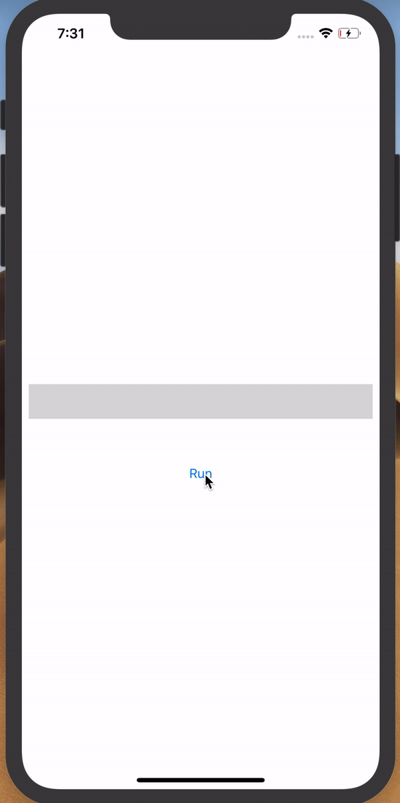

## Skeleton view sample

This repository contains a sample app of a loading view (skeleton view). This kind of view is useful to:

-   Let the user know that the content is loading
-   Show the user a "skeleton" of the content that will be shown.

The sample app contains a `UIView` that will be animated when the `Run` button is clicked. It consists of a moving gradient from left to right with a delay between each loop.

Tutorial [here](https://medium.com/the-aesthetic-programmer/facebook-loading-labels-animation-simple-approach-for-skeleton-view-in-swift-4-4fcdfeffd121)

## How to run

Open `SkeletonViewSample.xcodeproj` and run the app.

Click the `Run` button to start the animation.
